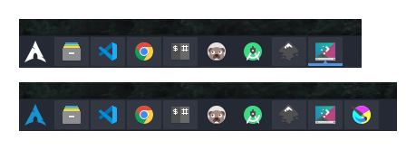

# KDE Plasma 5 App Launcher / ArchLinux Icons

> My [KDE Plasma 5](https://kde.org/plasma-desktop/) [App Launcher](https://userbase.kde.org/Plasma_application_launchers/en) with a custom [ArchLinux](https://www.archlinux.org/) icon.

_\* View of my [KDE Plasma 5 Task Manager](https://userbase.kde.org/Plasma/Tasks) using [Arc Theme](https://github.com/jnsh/arc-theme) with custom ArchLinux icon variants._

## Icons

The [icons](./icons) directory contains two SVG icon variants (white and blue).

To customize yours just follow these steps:

- Download an icon from this repository.
- Right click on your *"App Launcher"* then *"Edit panel"*.
- Now mouse over your *"App Launcher"* and click on *"configure"*.
- Finally on *the app launcher preferences* window just choose the downloaded icon.

## License

To the extent possible under law, [Jose Quintana](http://git.io/joseluisq) has waived all copyright and related or neighboring rights to this work.
